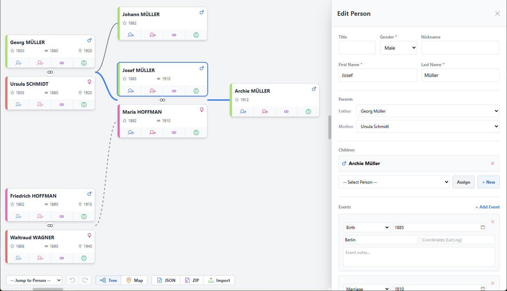
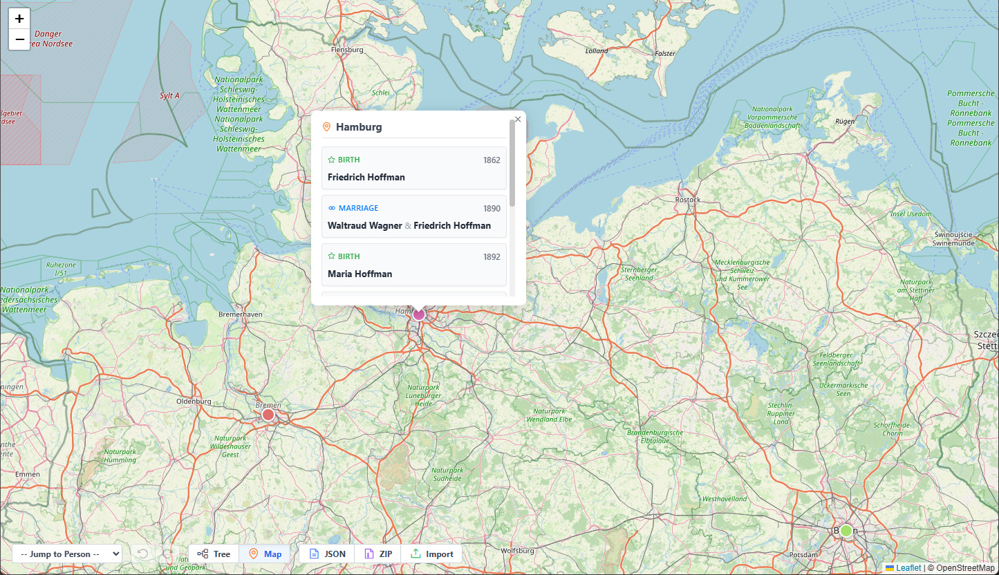

# Legacy 🌳

**Legacy** is a free, open-source, and minimal genealogy tool designed to help you build, organize, and research your family tree.

## 🚫 What it DOES NOT do

To ensure the application remains strictly lightweight, and portable, **Legacy does not support image hosting or document archiving.**

## ✨ Key Features

* **Interactive Tree View**: Visually navigate your ancestry with an intuitive, drag-and-pan canvas that handles complex family webs automatically.

* **Geographical Map View**: Automatically plot life events (births, marriages, deaths) on an interactive map.

* **Smart Data Management**: Document detailed life events, precise coordinates, and personal notes for every individual.

* **Lightweight & Offline-First**: Runs entirely in your web browser using local storage. No database, server, or cloud account required.

* **Import / Export**: Easily back up your research or share it with others via standard JSON or compressed GZIP formats.

* **Mobile-Friendly**: A fully responsive interface optimized for seamless data entry and navigation on smartphones and tablets.

* **Mistake-Proof**: Built-in Undo/Redo functionality ensures you can experiment and edit without fear of losing your progress.

## 🚀 Getting Started

Legacy is a zero-configuration, single-page application.

## 📊 Technologies & Libraries Used

* **HTML5**/**CSS3**/**JavaScript**

* **jQuery 4.0.0** - DOM manipulation and event handling

* **Tailwind CSS** - Utility-first CSS framework

* **Phosphor Icons** (via CDN) - Icon library

* **OpenStreetMap** (via Leaflet tile layer) - Map tiles

* **Nominatim API** (OpenStreetMap) - Geocoding service

* **Leaflet 1.9.4** - Interactive mapping

* **Leaflet MarkerCluster 1.4.1** - Map marker clustering

* **Compression Streams API** - GZIP compression/decompression for import/export

* **localStorage** - Client-side data persistence

## 📄 License

This project is completely open-source and free to use.

