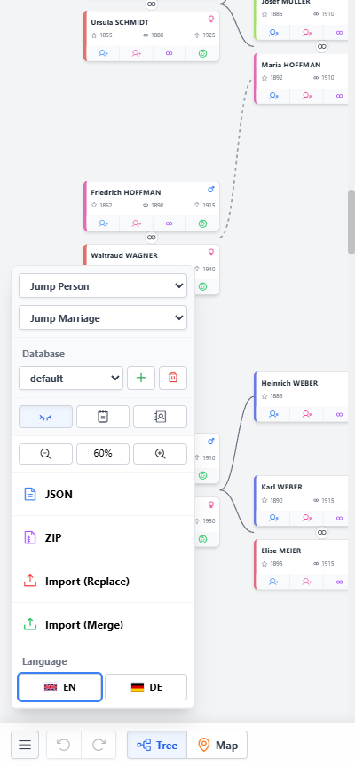

# Legacy 🌳

**Legacy** is a free, open-source, and minimal genealogy tool designed to help you build, organize, and research your family tree.

---

## 🚀 Getting Started

Legacy is a zero-configuration, single-page application. 

**Try it here → [github.io/njank/legacy](https://github.io/njank/legacy)**

---

## ✨ Key Features

* **Interactive Tree View**: Visually navigate your ancestry with an intuitive, drag-and-pan infinite canvas. Handles complex family webs automatically, and allows you to expand or collapse entire family branches to focus on specific lineages.
* **Geographical Map View**: Automatically geocodes and plots life events (births, marriages, deaths) and personal addresses on an interactive map. Groups dense areas intelligently using map clusters.
* **Smart Data Management**: Document detailed life events, precise coordinates, and personal notes. Organize individuals with custom color-coded categories, while the app auto-generates Roman numerals for namesakes (e.g., Karl I, Karl II).
* **Multiple Databases**: Manage completely separate family trees within the same app using the built-in database switcher.
* **Global Fuzzy Search**: Instantly locate people, specific addresses, event locations, or text snippets within notes across your entire tree.
* **Mistake-Proof**: Built-in Undo/Redo functionality ensures you can experiment and edit without fear of losing your progress. The app also intelligently handles structural changes (like dynamically updating the gender of partners and children if a parent's gender is corrected).
* **Lightweight & Offline-First**: Runs entirely in your web browser using local storage. No external database, backend server, or cloud account required.
* **Import / Export**: Easily back up your research or share it with others via standard JSON or compressed GZIP formats. You can choose to either overwrite your current tree or safely merge two trees together.
* **Mobile-Friendly**: A fully responsive interface with mobile-first menus, optimized for seamless data entry and touch-friendly navigation on smartphones and tablets.
* **Multilingual**: Fully localized interface available in English (EN) and German (DE).

---

## 🚫 What it DOES NOT do

To ensure the application remains strictly lightweight and portable, **Legacy does not support image hosting or document archiving.**

---

## 📊 Technologies & Libraries Used

* **HTML5** / **CSS3** / **JavaScript** (Vanilla ES6+)
* **jQuery 4.0.0** - DOM manipulation and event handling
* **Tailwind CSS** - Utility-first CSS framework
* **Phosphor Icons** (via CDN) - Minimalist UI Icon library
* **Leaflet 1.9.4** - Interactive mapping engine
* **Leaflet MarkerCluster 1.4.1** - Map marker clustering
* **OpenStreetMap** (via Leaflet tile layer) - Map tiles
* **Nominatim API** (OpenStreetMap) - Asynchronous geocoding service
* **Compression Streams API** - Native browser GZIP compression/decompression for local imports/exports
* **localStorage** - Client-side offline data persistence

---

## 📄 License

This project is completely open-source and free to use.